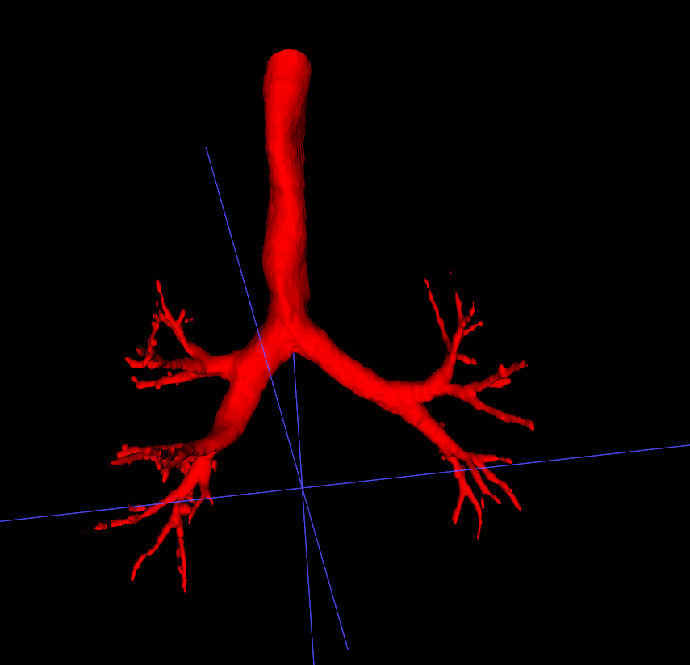
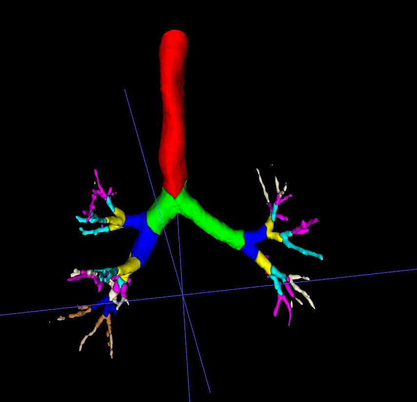
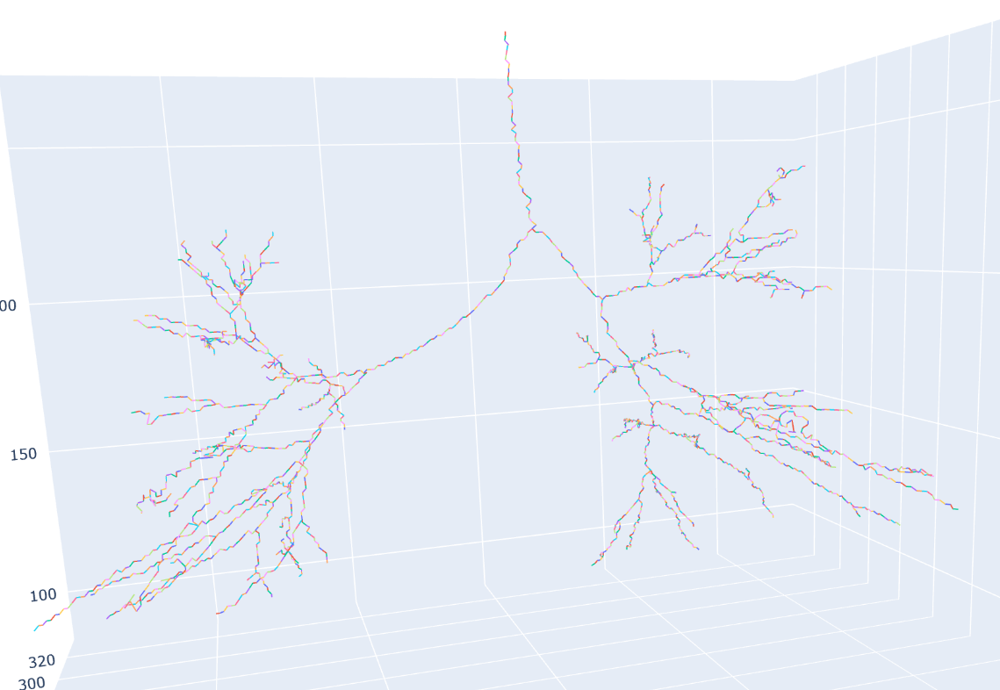

# Airway Segmentation And Generation Labeling Tool

[**NaviAirway: a Bronchiole-sensitive Deep Learning-based Airway Segmentation Pipeline**](https://arxiv.org/abs/2203.04294) 논문의 모델을 기반으로 airway segmentation을 얻은 후, 얻어진 segmentation에서 각 voxel이 어떤 generation에 속하는지 labeling합니다.

|||
|:---:|:---:|
|Airway Segmentation|Generation Labeling된 Airway Segmentation|

## 실행 방법
현재로서는 python 및 conda 환경을 구축한 다음에 코드를 실행할 수 있습니다. 이런 환경 설정 없이 stand-alone 방식으로 실행될 수 있는 패키지를 만드는 방법은 현재 구상 중입니다.

### 1. Anaconda 가상환경 생성 및 활성화

```
conda create -p ./.conda
conda activate -p ./.conda
```

### 2. 필요 패키지 설치
```
pip install -r requirements.txt
```
PyTorch의 경우, GPU를 이용한 추론을 위해서는 추가적인 설정이 필요할 수 있습니다. [여기](https://pytorch.org/get-started/locally/)를 참조해 주세요.

### 3. infer.py 실행
CT 이미지 파일에서 airway segmentation 결과를 
```
# conda 가상환경이 활성화되지 않았다면 아래 줄의 주석을 지우고 실행
# conda activate -p ./.conda
python infer.py \
    --weight_path WEIGHT_PATH [WEIGHT_PATH ...] \
    --image_path IMAGE_PATH [IMAGE_PATH ...] \
    [--select_dir] \
    --save_path SAVE_PATH \
    [--threshold THRESHOLD] \
    [--segmentation_only] \
    [--branch_penalty BRANCH_PENALTY] \
    [--prune_threshold PRUNE_THRESHOLD] \
    [--use_bfs] \
    [--do_not_add_broken_parts] \
    [--device DEVICE]
```
대괄호 안에 있는 매개변수는 명령어에 포함되지 않아도 되는 매개변수입니다. <br>
각 매개변수에 대한 설명은 다음과 같습니다.

* ```--weight_path```: 추론에 사용할 모델 가중치의 경로. 2개 이상의 가중치를 사용하여 앙상블 추론도 가능합니다.
* ```--image_path```: 추론할 CT 이미지의 파일(또는 파일이 들어있는 폴더) 경로. 추론에 사용할 이미지는 [ITK-SNAP](http://www.itksnap.org/) 등의 툴을 이용해 ```*.nii.gz``` 형식의 파일로 변환된 상태여야 합니다.
* ```--select_dir```: 이 매개변수가 명령어에 포함되어 있으면, ```--image_path``` 매개변수의 동작이 달라집니다.<br>
```--select_dir```가 명령어에 포함되어 있지 않으면, ```---image_path```의 하위 매개변수인 각 ```IMAGE_PATH```는 CT 이미지 **파일**의 경로여야 합니다. 이때 프로그램은 각 ```IMAGE_PATH```에 해당되는 이미지 파일에 대해 추론을 진행합니다.<br>
```--select_dir```가 명령어에 포함되어 있으면, ```---image_path```의 하위 매개변수인 각 ```IMAGE_PATH```는 CT 이미지 파일이 있는 **폴더**의 경로여야 합니다. 이때 프로그램은 각 ```IMAGE_PATH```에 해당되는 폴더 내에 있는 CT 이미지 파일들에 대해 추론을 진행합니다.<br>
* ```--save_path```: 결과 파일들을 저장할 **폴더**의 경로입니다. 존재하지 않는 폴더라면 프로그램이 실행될 때 폴더를 알아서 만들어 줍니다.
* ```--threshold```: 이미지를 segmentation 모델에 넣어서 출력되는 값은 일차적으로 각 voxel이 airway 분류에 속할 확률값입니다. 이 확률값이 ```THRESHOLD```의 값 이상이면 해당 voxel을 airway로 판단하고, 그렇지 않으면 airway가 아니라고 판단하게 됩니다. 기본값은 ```0.7```입니다.
* ```--segmentation_only```: 이 매개변수가 명령어에 포함되어 있으면, generation labeling 및 관련 작업들을 수행하지 않고 segmentation 결과 및 관련 정보만 파일로 저장합니다.
* ```--branch_penalty```, ```--prune_threshold```, ```--use_bfs```, ```--do_not_add_broken_parts```: 알고리즘 비교/분석 및 디버깅을 위해 만들어 둔 매개변수입니다. 웬만하면 쓰지 마세요.
* ```--device```: 딥러닝 모델을 돌릴 연산 장치를 설정합니다. 기본값은 ```cuda```로 설정되어 있어 nVidia GPU로 연산을 하게 되며, nVidia GPU가 없거나 사용 중 오류가 발생하는 경우 ```cpu```로 값을 변경하여 CPU로 연산을 하게 하면 문제가 해결될 수 있습니다.

또는, 매개변수의 내용을 별도의 파일에 작성한 뒤 ```python infer.py <file_name>```과 같은 방식으로 실행할 수도 있습니다.
<br>

* 예시

아래 코드는 가중치 ```checkpoint/checkpoint.pkl```와 ```checkpoint/checkpoint_semi_supervise_learning.pkl```를 이용해 ```data/KH1_3D``` 폴더 아래의 모든 CT 이미지 파일에 대해 추론을 진행합니다.
```
python infer.py \
    --weight_path checkpoint/checkpoint.pkl checkpoint/checkpoint_semi_supervise_learning.pkl \
    --image_path data/KH1_3D \
    --select_dir \
    --save_path results/KH1_3D \
    --threshold 0.6
```

아래 코드는 가중치 ```checkpoint/checkpoint.pkl```와 ```checkpoint/checkpoint_semi_supervise_learning.pkl```를 이용해 ```data/KH1_3D``` 폴더 아래의 ```00236849_20220513_ex.nii.gz```와 ```00236849_20220513_in.nii.gz``` 파일에 대해 추론을 진행합니다.
```
python infer.py \
    --weight_path checkpoint/checkpoint.pkl checkpoint/checkpoint_semi_supervise_learning.pkl \
    --image_path data/KH1_3D/00236849_20220513_ex.nii.gz data/KH1_3D/00236849_20220513_in.nii.gz \
    --save_path results/KH1_3D \
    --threshold 0.6
```

만약 ```infer_args.txt``` 파일에 아래와 같은 내용을 적고 ```python infer.py infer_args.txt``` 명령어를 실행시키면, 예시의 첫 번째 코드 블럭과 같은 동작을 합니다.
```
--weight_path checkpoint/checkpoint.pkl checkpoint/checkpoint_semi_supervise_learning.pkl
--image_path data/KH1_3D
--select_dir
--save_path results/KH1_3D
--threshold 0.6
```


### 4. break_by_gen.py 실행
```infer.py``` 또는 외부 segmentation 모델로 airway segmentation만 얻었을 때, 이 segmentation에서 generation labeling만 실행합니다. <br>
아직 README를 제대로 작성하고 일반 사용자가 쉽게 실행할 수 있을 정도로 코드를 다듬지 못했습니다. 나중에 만들어둘게요.


## 출력 파일 설명
결과 파일이 들어있는 폴더는 다음과 같은 구조입니다.
```
<save_path>
│
├── by_gen
│   ├── case1_segmentation_by_gen.nii.gz
│   ├── case1_segmentation_by_gen_left.nii.gz
│   ├── case1_segmentation_by_gen_right.nii.gz
│   ├── case2_segmentation_by_gen.nii.gz
│   ├── case2_segmentation_by_gen_left.nii.gz
│   ├── case2_segmentation_by_gen_right.nii.gz
│   └── ....
│
├── centerline
│   ├── case1_segmentation_by_gen.nii.gz
│   ├── case2_segmentation_by_gen.nii.gz
│   └── ...
│
├── extended_segment
│   ├── case1_segmentation.nii.gz
│   ├── case2_segmentation.nii.gz
│   └── ...
│
├── extended_segment_before_preprocess
│   ├── case1_segmentation.nii.gz
│   ├── case2_segmentation.nii.gz
│   └── ...
│
├── orig_segment
│   ├── case1_segmentation.nii.gz
│   ├── case2_segmentation.nii.gz
│   └── ...
│
├── orig_segment_before_preprocess
│   ├── case1_segmentation.nii.gz
│   ├── case2_segmentation.nii.gz
│   └── ...
│
├── trace_slice_area_info
│   ├── trace_slice_area_info_case1.csv
│   ├── trace_slice_area_info_case2.csv
│   └── ...
│
├── generation_info.csv
├── pixdim_info.csv
└── trace_volume_by_gen_info.csv
```

### ```by_gen``` 폴더의 하위 파일
```
<CASE_NAME>_segmentation_by_gen.nii.gz
<CASE_NAME>_segmentation_by_gen_left.nii.gz
<CASE_NAME>_segmentation_by_gen_right.nii.gz
```
각 CT 이미지마다 위와 같은 이름의 파일이 3개씩 생성됩니다. <br>

### ```centerline``` 폴더의 하위 파일
airway segmentation에서 generation labeling을 하기 이전 과정으로, segmentation 결과에서 centerline point를 추출하고 centerline point끼리 선으로 이어주어 segmentation 결과의 위상적 형태를 찾아내는 과정이 있습니다. ```centerline``` 폴더에는 이렇게 추출된 centerline point들 및 centerline point간의 연결 관계를 시각적으로 확인할 수 있는 html 파일이 있습니다. 아래 그림은 추출된 centerline point 및 연결 관계의 예시입니다.

<p style="text-align:center">
    <br>
</p>


### ```extended_segment``` 폴더의 하위 파일
```
<CASE_NAME>_segmentation.nii.gz
```
각 CT 이미지마다 위와 같은 이름의 파일이 1개씩 생성됩니다. <br>
CT 이미지의 slice 갯수가 너무 적을 경우 딥러닝을 이용한 segmentation 모델이 segmentation을 제대로 생성할 수 없는 경우가 있습니다. 이럴 때는 일반적인 2차원 이미지의 크기를 늘리는 것과 비슷한 방식으로 slice 갯수를 보간을 통해 늘린 후 segmentation 모델에 넣습니다. 이렇게 하면 모델의 출력으로 나오는 segmentation도 slice 갯수가 늘어난 상태로 나옵니다.<br>
```extended_segment```와 아래의 ```extended_segment_before_preprocess```는 이렇게 slice 갯수가 늘어난 상태의 segmentation 파일을 담고 있고, ```orig_segment```와 ```orig_segment_before_preprocess```는 slice 갯수를 원래대로 줄여놓은 상태의 segmentation 파일을 담고 있습니다.

### ```extended_segment_before_preprocess``` 폴더의 하위 파일
```
<CASE_NAME>_segmentation.nii.gz
```
각 CT 이미지마다 위와 같은 이름의 파일이 1개씩 생성됩니다. <br>
딥러닝을 이용한 segmentation 모델에서 출력되는 segmentation은 기도가 여러 조각으로 나뉘어 있는 현상이 발생할 수 있습니다. 위의 ```extended_segment```와 ```orig_segment```는 여러 조각으로 나뉜 segmentation을 합치고, 노이즈로 판단되는 조각은 제거한 뒤의 segmentation 결과입니다. <br>```extended_segment_before_preprocess```와 ```orig_segment_before_preprocess```는 그러한 후처리를 거치지 않은 상태의 segmentation 결과입니다.

### ```orig_segment``` 폴더의 하위 파일
```
<CASE_NAME>_segmentation.nii.gz
```
각 CT 이미지마다 위와 같은 이름의 파일이 1개씩 생성됩니다. <br>
```extended_segment```의 설명을 참고해 주세요.

### ```orig_segment_before_preprocess``` 폴더의 하위 파일
```
<CASE_NAME>_segmentation.nii.gz
```
각 CT 이미지마다 위와 같은 이름의 파일이 1개씩 생성됩니다. <br>
```extended_segment_before_preprocess```의 설명을 참고해 주세요.

### ```trace_slice_area_info``` 폴더의 하위 파일
```generation_info.csv```를 만들 때처럼 generation 11 이상으로 분류된 voxel은 모두 없는 것으로 간주하고 자료를 생성했습니다. 따라서 generation 10으로 분류된 branch는 모두 terminal branch(끝점)로 분류됩니다.<br>
다른 csv 파일과는 다르게 segmentation 하나에 대해 수천~1만여 줄의 output이 나와서 부득이하게 segmentation마다 다른 파일로 저장되게 했습니다. 파일 하나의 각 행은 기도의 시작점 - 끝점을 잇는 경로 상의 각 centerline point 점에 대해 다음과 같은 정보를 포함하고 있습니다.

|열 이름|자료형|설명|
|------|------|----|
|path|문자열|generation labeling을 진행한 airway segmentation 파일의 경로|
highest_generation|정수|검출된 끝점의 generation|
|endpoint_x, endpoint_y, endpoint_z|정수|검출된 끝점의 좌표|
|generation|정수|끝점에서 ```dist_from_endpoint```만큼 떨어진 centerline point의 generation|
|x, y, z|정수|끝점에서 ```dist_from_endpoint```만큼 떨어진 centerline point의 x, y, z 좌표|
|dist_from_endpoint|정수|끝점에서 현재 행에 해당하는 centerline point까지의 거리
|slice_area|실수|현재 행에 해당하는 cetnerline point에서의 기도 단면적 (mm^2). 기도 직경은 segmentation을 z축에 수직인 평면으로 자른 slice를 이용해 구함.
|slice_diameter|실수|현재 행에 해당하는 cetnerline point에서의 기도 직경 (mm^2). 기도 단면이 완전한 원형이라 가정하고 $\sqrt{}$(slice_area/PI) * 2로 값을 구했습니다.

끝점에서 ```dist_from_endpoint```만큼 떨어진 centerline point라는 것은, 물리적으로 몇 mm만큼 떨어졌는지는 의미하는 것이 아닙니다. 아래 그림에서 끝 점에서 출발하여 몇 개의 선을 지나야 해단 centerline point에 도달할 수 있는지를 말하는 것입니다.

<p style="text-align:center">
    <br>
</p>

### ```generation_info.csv```
|열 이름|자료형|설명|
|-------|-------|---|
|path|문자열|generation labeling을 진행한 airway segmentation 파일의 경로
|1_volume_total, 2_volume_total, ... , 10_volume_total|실수|기도 전체에서 1~10번째 generation에 해당하는 기도의 부피 (mm^3)|
|volume_sum_total|실수|기도 전체에서 1~10번째 generation에 해당하는 기도 부피의 합|
|1_volume_ratio_total, 2_volume_ratio_total, ... , 10_volume_ratio_total|실수|기도 전체에서 1~10번째 generation에 해당하는 기도의 상대적인 부피 <br> (generation별 부피) / (기도 전체 부피)|
|1_volume_l, 2_volume_l, ... , 10_volume_l|실수|왼쪽 폐 부분의 기도에서 1~10번째 generation에 해당하는 기도의 부피 (mm^3)|
|volume_sum_l|실수|왼쪽 폐 부분의 기도에서 1~10번째 generation에 해당하는 기도 부피의 합|
|1_volume_ratio_l, 2_volume_ratio_l, ... , 10_volume_ratio_l|실수|왼쪽 폐 부분의 기도에서 1~10번째 generation에 해당하는 기도의 상대적인 부피 <br> (generation별 부피) / (왼쪽 기도 전체 부피)|
|1_volume_r, 2_volume_r, ... , 10_volume_r|실수|오른쪽 폐 부분의 기도에서 1~10번째 generation에 해당하는 기도의 부피 (mm^3)|
|volume_sum_r|실수|오른쪽 폐 부분의 기도에서 1~10번째 generation에 해당하는 기도 부피의 합|
|1_volume_ratio_r, 2_volume_ratio_r, ... , 10_volume_ratio_r|실수|오른쪽 폐 부분의 기도에서 1~10번째 generation에 해당하는 기도의 상대적인 부피 <br> (generation별 부피) / (오른쪽 기도 전체 부피)|
|upside_down|정수|segmentation의 위아래가 뒤집어진 상태로 주어졌는지를 나타내는 값. 디버깅용으로 사용되었으며, 임상적 분석에서는 의미가 없습니다.
|has_pixdim_info|정수|voxel 간 spacing 정보가 제공되었는지에 대한 정보.|
|last_branch_observed|정수|감지된 branch 중 generation이 제일 높은 branch의 generation|
|no_of_bronchlole_at_the_last_branch_total|정수|generation이 ```last_branch_observed```와 같은 branch의 갯수|
|vol_of_bronchlole_at_the_last_branch_total|실수|generation이 ```last_branch_observed```와 같은 branch의 부피 총합|
|no_of_bronchlole_at_the_last_branch_l|정수|왼쪽 폐에서 generation이 ```last_branch_observed```와 같은 branch의 갯수|
|vol_of_bronchlole_at_the_last_branch_l|실수|왼쪽 페에서 generation이 ```last_branch_observed```와 같은 branch의 부피 총합|
|no_of_bronchlole_at_the_last_branch_r|정수|오른쪽 폐에서 generation이 ```last_branch_observed```와 같은 branch의 갯수|
|vol_of_bronchlole_at_the_last_branch_r|실수|오른쪽 페에서 generation이 ```last_branch_observed```와 같은 branch의 부피 총합|


원래는 generation 11 이상에 해당되는 voxel의 부피는 ```10+```라는 열로 generation 10에 해당되는 voxel의 부피와 합쳐서 출력했었습니다. 하지만 너무 높은 generation로 분류된 voxel은 노이즈일 가능성이 크고 실제 분석에 방해가 될 수도 있기 때문에 출력 결과에서 아예 제외해 달라는 요청이 있었습니다. 이에 따라 generation 11 이상에 해당되는 voxel은 아예 없는 것으로 치고 ```generation_info.csv```를 만들었으며, ```sum``` 열에도 generation 11 이상으로 분류된 voxel의 부피는 포함되어 있지 않습니다.

### ```pixdim_info.csv```
입력된 CT 이미지에서 voxel 하나가 물리적으로 몇 mm * 몇 mm * 몇 mm인지에 대한 정보를 포함하고 있습니다. Airway segmentation 결과에서 트리 구조를 추출하고 generation 별 부피를 구하는 데 필요하지만, 이런 것을 모두 구한 다음에 임상적 결과를 분석하는 단계에서는 필요하지 않습니다.

### ```trace_volume_by_gen_info.csv```

```generation_info.csv```를 만들 때처럼 generation 11 이상으로 분류된 voxel은 모두 없는 것으로 간주하고 자료를 생성했습니다. 따라서 generation 10으로 분류된 branch는 모두 terminal branch(끝점)로 분류됩니다.<br>
|열 이름|자료형|설명|
|-------|-------|---|
|path|문자열|generation labeling을 진행한 airway segmentation 파일의 경로|
|highest_generation|정수|검출된 끝점의 generation|
|x, y, z|정수|검출된 끝점의 좌표|
|1, 2, 3, ... , 10|실수|기도의 시작점 - 검출된 끝점을 잇는 경로에서 각 generation에 해당하는 기도의 부피 (mm^3)|
|1_ratio, 2_ratio, ... , 10_ratio|실수|기도의 시작점 - 검출된 끝점을 잇는 경로에서 각 generation에 해당하는 기도의 부피 비율|
|endpoint_area|실수|검출된 끝점에서의 기도 단면적 (mm^2). 기도 직경은 segmentation을 z축에 수직인 평면으로 자른 slice를 이용해 구함.
|endpoint_diamenter|실수|검출된 끝점에서의 기도 직경 (mm^2). 기도 단면이 완전한 원형이라 가정하고 $\sqrt{}$(endpoint_area/PI) * 2로 값을 구했습니다.

각 끝점은 ```path, x, y, z``` 4개의 값으로 표현됩니다. 저 4개의 값이 모두 같으면 같은 끝점이고, 하나라도 값이 다르다면 다른 끝점입니다.